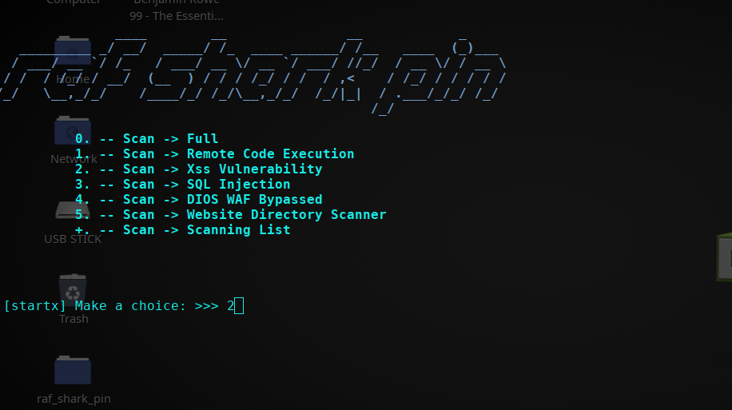

About
------

RAF SHARK PIN is an open source software in python language which lets you automated penetration testing and automated information gathering. This software can be run on Windows/Linux/OSX under Python. Project was created to automated for information gathering, vulnerability scanning and eventually generating a report for networks.

How is Work
---------------------

Install "dependencies"
------------------------
pip3 install -r requirements.txt

---------------------------------------

Usage
------
Open Terminal, - run this line:
 
python3  rafstorm.py

python3  rafstorm.py -h 

help (Info about Project)

================================================================

License & Copyright
--------------------

Licensed under the [MIT License](LICENSE)

Donation Project
------------------
Etherium:       0x14996EE0113C46A34b14e4F30197768b174c9486

Bitcoin Cash:   qz7h44sqpn8ud2hv04tw2kgr9ayqu94gngm2tedvrt

Bitcoin:        1HN7eNRiJFWR1JXQdMx2hwVCaANmbhnUrb

Tipeeestream:   https://www.tipeeestream.com/rob-giuliano/donation

